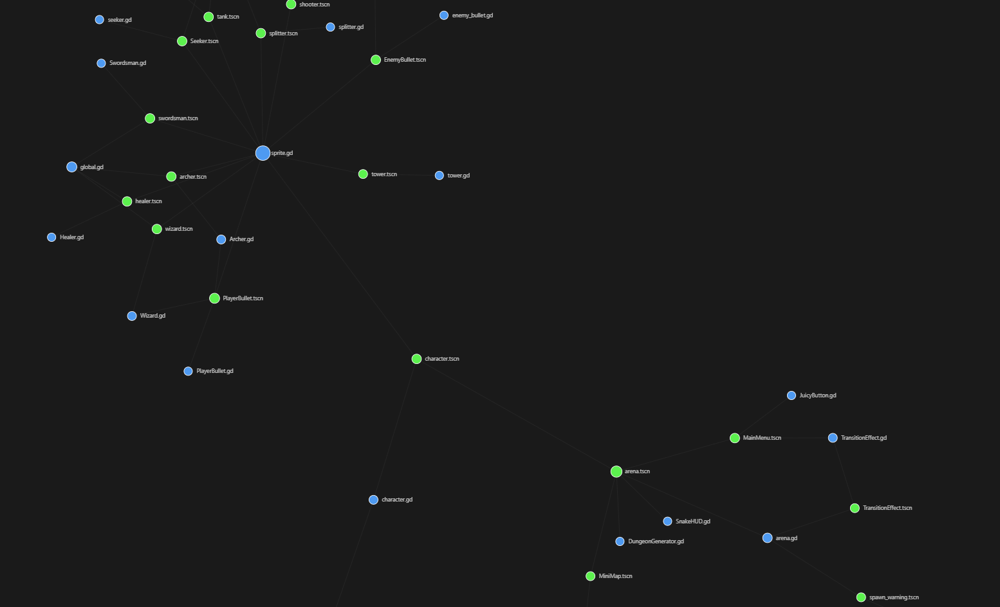
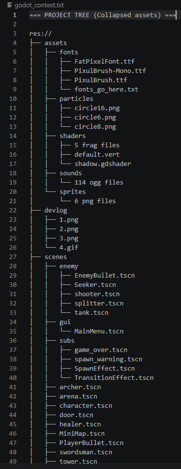
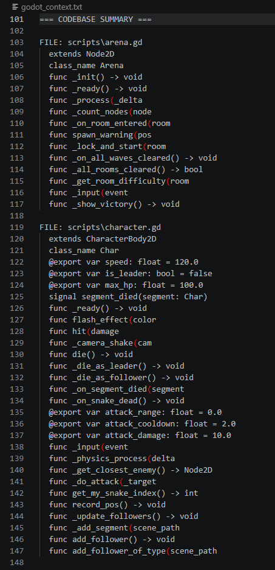

# Godot Architect 🛠️

  

A command-line tool for Godot 4 that allows you to visualize project dependencies via a graph and generate structured context via ASCI.

  
# 🖼️ Preview
### Interactive Graph



  

### ASCII Context Tree



  

### ASCII Asset Tree




# 🚀 Quick Start

  

## Generate interactive dependency graph (HTML)

python main.py "path/to/godot_project" --graph

  

## Generate ASCII tree for AI context (TXT)

python main.py "path/to/godot_project" --tree

  
  

### ⚙️ Arguments

  

| Flag | Description |

| :--- | :--- |

| `--graph` | Generate `project_graph.html` (Interactive D3.js dependency graph). |

| `--tree` | Generate `godot_context.txt` (ASCII project structure). |

| `--code` | (Optional) Include script API (signals, methods, @exports) in the tree. |

| `-l`, `--limit` | Set the collapse limit for assets (e.g., `.png`, `.wav`). Default: 3. |

  

## 💡 Use Cases & Examples

  

**1. ASCII:**

```bash

python  main.py  "path/to/project"  --tree  --code  --limit  10
```

**2. Visual Dependency Audit:**

```bash

python  main.py  "path to your project"  --graph

```

**3. Asset Overview:**

```bash

python  main.py  "path to your project"  --tree  --limit  1

```

  

